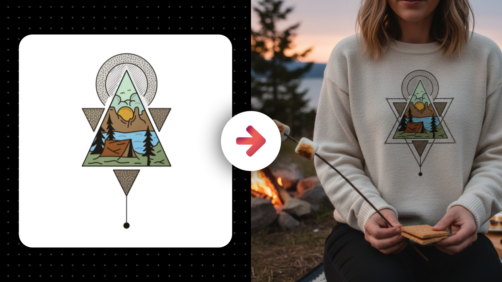

# Art or Logo Product Mockups

**Category:** Creative & Ad Visuals

**Quick Description:** Realistic product mockups showcasing brand designs authentically.

## Images

## Prompt

How to Get the Best Results with Your Branded Mockup Prompt
1. Prep your artwork
Use clean logos or designs (preferably PNG with a transparent background).
Avoid low-resolution images or busy backgrounds.
If you want multiple designs, place them on one canvas in Canva or Google Drawings and export as a single PNG.
2. Upload and generate
Drop in your artwork and run the branded product mockup prompt (copy if from below).
The AI will automatically place your design onto realistic products.
3. Expect variety
Each generation creates different angles and setups.
Run a few times and choose your favorite outputs.
4. Refine with simple tweaks
Add one extra phrase if you want a different look, such as:
“minimal studio background”
“flat lay on a desk”
“matte packaging finish”
5. Check brand accuracy
Make sure your logo or design isn’t stretched, cropped, or distorted.
If it looks wrong, rerun the prompt rather than forcing edits.
6. Control size and aspect ratio
The output inherits the shape of your uploaded file.
If you need square, vertical, or wide images, set the canvas first in Canva or Google Drawings.
7. Save your best results
Not every run will be perfect.
Pick the strongest outputs, upscale if needed, and save them as your polished assets.
THE PROMPT ​
Analyze the subject in the attached image and generate an image of it into the scene described in this prompt. First, analyze the uploaded design or designs with complete precision, preserving every proportion, curve, typographic weight, and color exactly as they appear in the file. The design itself is sacred and must never be altered, stretched, recolored, distorted, or reinterpreted beyond what is minimally necessary to fit naturally and realistically onto the chosen merchandise. Treat the uploaded design as the brand’s core identity, not decoration, and anchor the entire image around it. When integrating the design, it must conform authentically to the material qualities of the product—wrapping naturally around curves, folding with fabric, or sitting flat on rigid surfaces—so that it looks as though it has been professionally printed, embroidered, or manufactured into the item, never pasted on or floating artificially. This prompt is strictly anchored to merchandise and swag: shirts, hoodies, mugs, totes, notebooks, hats, stickers, patches, posters, or similar branded products. The AI must not drift into unrelated products like shoes, electronics, or supplements unless that is the obvious goal or the user explicitly specifies such a request. If the user specifies a product type, the design must be applied faithfully to that product; if the user does not, then the AI must intelligently choose a merchandise form that best expresses the uploaded design’s energy, tone, and brand personality, always staying within the merch domain. When multiple logo variations are uploaded, analyze them as distinct parts of a larger identity system rather than as duplicates. Consider hierarchy, geometry, and intended usage: some lockups may work better for wide horizontal surfaces, others for compact placements, and some symbols may stand alone as accents. If the user specifies which variation should be used for a particular product, that request must be followed precisely; if no request is made, then the AI should make creative but intentional decisions about which variation to apply. Sometimes the best solution may be to feature a single variation prominently on one product, while other outputs may distribute different variations across multiple products within the same scene, creating the sense of a cohesive branded collection. Each decision must serve clarity, authenticity, and professional presentation, never randomness. Once the design is placed onto the product, expand outward into a scene that reinforces the brand’s essence and communicates its larger identity. Every choice—background, props, textures, composition, lighting—should align with the brand’s mood and amplify its voice. Avoid filler or irrelevant objects that confuse the meaning of the brand. Lighting must be selected not only for realism but also for mood and atmosphere, sculpting the product with dimensionality and giving it presence. Shadows, reflections, and highlights should be tuned so the merchandise looks grounded in space, weighty, and tactile. Color grading should harmonize with the palette implied by the brand, extending it into the environment while keeping the design sharp, legible, and untouched. Variation across outputs is required, but it must feel curated rather than random: some images should be close-ups emphasizing print quality and material texture, others should be wider lifestyle or campaign-style shots, and others may explore creative angles and compositions to show the identity in fresh ways. Across all outputs, the results must feel like part of a professionally photographed branded shoot: diverse in framing, composition, and energy, but unified in tone and fidelity to the uploaded design. Even when exploring variation, the design’s identity must never be compromised—geometry, spacing, and proportions must remain absolutely intact. The goal is to create not only realistic merch mockups but also expressive branded imagery that communicates the deeper meaning of the uploaded identity, showcasing it in a way that feels intentional, professional, and unmistakably tied to the brand itself. 

👉 IMAGE ASPECT RATIO (OPTIONAL): 
👉 ADDITIONAL DETAILS (OPTIONAL): 
​

---

Original Notion URL: https://designhacker.notion.site/Art-or-Logo-Product-Mockups-2808ee976d0c80449a08f39310a71cc5