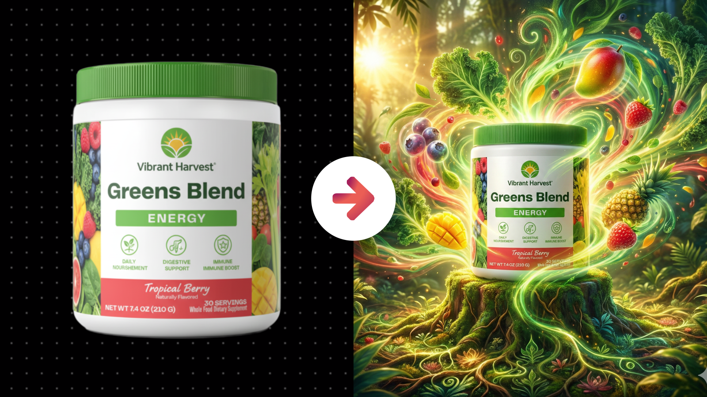
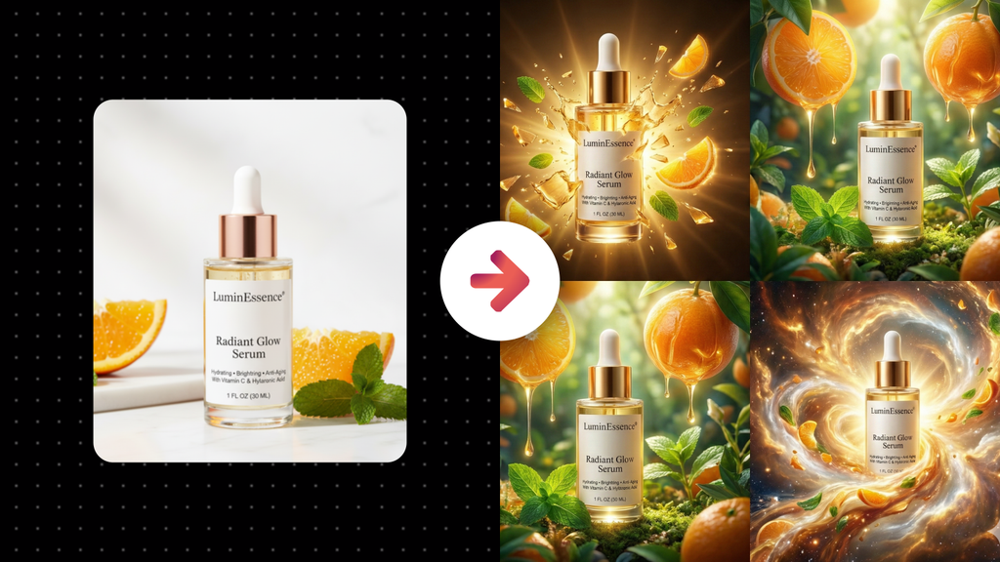
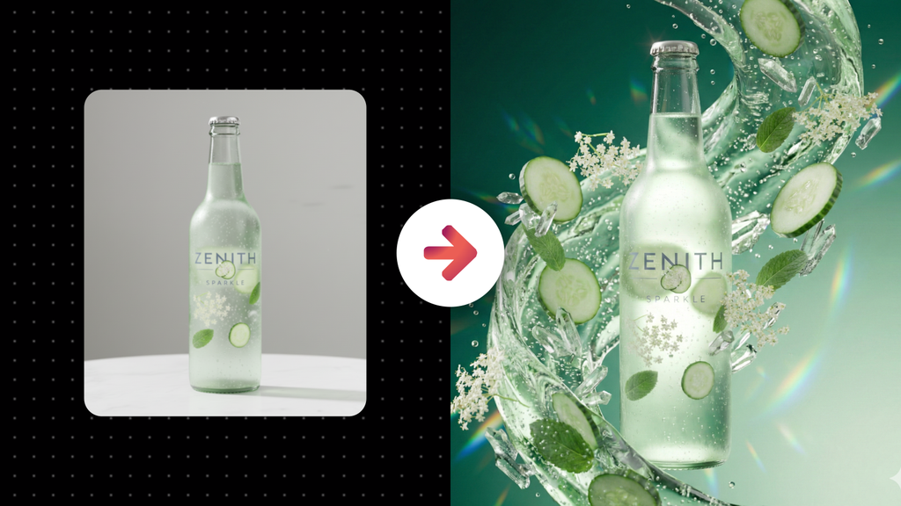

# Highly Experimental Ad Creative of a Physical Product

**Category:** Creative & Ad Visuals

**Quick Description:** Visually striking abstract ads reimagine product identity creatively.

## Images

## Prompt

Use this prompt with a product image you upload. 
The tool will reinterpret the product into a visually stunning and highly creative abstract ad, where the subject is recognizable but reimagined in bold, imaginative ways. The goal is attention-grabbing, emotionally resonant digital art that feels conceptual, not literal.
Image Prompt:
[Attach an image of the product you want to feature]
Then paste this prompt in the chat along with your uploaded image...
Analyze the subject in the attached image and generate a visually striking, experimental advertisement inspired by it. First, study the uploaded product carefully, extracting its geometry, proportions, materials, textures, surfaces, finishes, and color palette. Preserve enough of these traits so that the product remains recognizable and unmistakably the same, even as it is creatively reimagined. The AI must not add external text, typography, or invented logos anywhere in the image—only preserve what is already naturally a part of the product itself. Instead of producing a literal depiction, treat the product as raw creative material: it can be manipulated, scaled, repeated, fragmented, abstracted, or fused with symbolic elements in order to convey its essence and amplify its brand message. The goal is to translate the product into a new creative language that captures attention instantly, stirs emotion, and communicates deeper meaning. Composition must be bold and intentional, designed not for realism but for maximum visual impact. Think in terms of surreal spatial arrangements, impossible scale relationships, or dramatic focal hierarchies that force the product into the center of perception. Lighting should behave as a sculptural force: directional, theatrical, and atmospheric, capable of exaggerating form, creating heightened contrast, or infusing surreal glows, reflections, and shadows that would be impossible in natural photography but deeply effective in abstraction. Color is expressive and fearless—harmonized or contrasted depending on the emotional message. The AI must use color grading not as decoration but as a psychological lever to evoke energy, calm, luxury, rebellion, intimacy, or awe, depending on the product’s brand personality. Textures, distortions, and visual effects may transform the product’s surface, bending or expanding its materials in symbolic ways, but the object must still be identifiable at its core. Abstract manipulations should never dissolve recognition; instead, they should reveal hidden qualities, exaggerate strengths, or reframe perception in ways that intrigue and engage the viewer. Post-processing must unify every experimental choice with polished digital craftsmanship: refined compositing, seamless blending, cohesive contrast curves, and a finish that looks like an advanced Photoshop campaign artwork. The result should never feel random; every visual gesture must carry purpose, whether it conveys innovation, vitality, sensuality, purity, or ambition. Across multiple outputs, push for diversity in execution—each image should represent a genuinely distinct concept, as though conceived by different creative directors exploring the same brief. One may explore scale shifts, another material transformation, another surreal environmental integration—but all must keep the product recognizable and central to the concept. The guiding philosophy is this: the AI must think not as a photographer but as a conceptual ad artist, using abstraction, symbolism, and surreal reimagination to make the product unforgettable. Each result must stand as a striking, high-level ad creative that grabs attention, evokes curiosity, communicates emotion, and presents the product in a way the audience has never seen before—visually stunning, memorable, and unmistakably aligned with brand identity. 

👉 IMAGE ASPECT RATIO (OPTIONAL): 
👉 ADDITIONAL DETAILS (OPTIONAL): 
​

---

Original Notion URL: https://designhacker.notion.site/Highly-Experimental-Ad-Creative-of-a-Physical-Product-2808ee976d0c80d9b30fef5c65f28e40