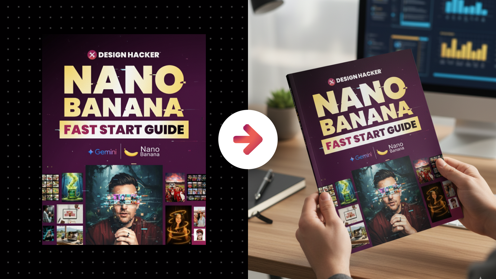

# Realistic Digital Download Mockup POV

**Category:** Digital Download Mockups

**Quick Description:** Realistic POV mockup showcasing premium document design.

## Images

## Prompt

Use this prompt with your uploaded document design. 
The tool will integrate your exact design into a premium point-of-view mockup scene, making it feel like a high-value resource the viewer is already holding.
Image Prompt:
[Attach an image of you or the main subject of your image]
Then paste this prompt in the chat along with your uploaded image...
Analyze the subject in the attached image and generate an image of them into the scene described in this prompt. First, analyze the uploaded document design with total precision, capturing every element exactly as it is: typography, layout, imagery, spacing, proportions, and color palette must be preserved without distortion, cropping, stretching, or artistic reinterpretation. The design identity is sacred and must remain flawless—the uploaded document is the hero of the final image and must appear exactly as intended by its designer. Then, generate a point-of-view scene where the resource is being held in the viewer’s own hands, as though they are experiencing the guide, workbook, checklist, or report firsthand. If the file is vertical, depict it either as a premium printed piece—like a bound workbook, glossy guide, or smooth matte report—or on a vertical tablet such as an iPad. If shown as printed, it must be full bleed with no edges visible, filling the page with design in a way that communicates high production value. Paper must look premium: crisp, sharp, and richly printed with smooth surfaces, subtle texture, or refined gloss depending on the mood. The mockup should never feel like a flimsy handout but rather like a high-end resource worth paying for. If the document is horizontal, it may be shown naturally on a laptop in this POV perspective. In all cases, the proportions of the design must remain intact, with every detail perfectly sharp and legible. The background must be a blurred branded scene, designed to amplify the message and benefits of the resource without distracting from it. For example, a productivity checklist might appear in front of a softly blurred organized desk with minimal tools and clean lines, signaling focus and efficiency. A creative workbook might be held with vibrant, blurred art supplies, color fields, or dynamic patterns faintly in the background, signaling inspiration. A financial report might be paired with blurred cues of elegance and stability—like sleek desks, subtle metallic tones, or refined props that signal success and professionalism. A wellness or lifestyle guide might feature soft, blurred cues of calm—natural textures, greenery, or cozy lifestyle props. All props and environmental choices must feel intentional, directly reinforcing the value and promise of the resource itself so the audience instantly understands what it delivers and why it matters. The perspective must feel immersive, as though the viewer is already in possession of the resource, experiencing its benefits firsthand. Lighting should sculpt the resource to feel premium: soft daylight for approachable, inspiring guides; crisp directional lighting for bold, authoritative resources; or moody cinematic tones for deep, impactful reports. Depth of field must ensure that the document and hands are tack-sharp while the branded environment softly blurs behind, keeping attention locked on the content. Variation is essential: sometimes the document fills almost the entire frame, making the content the sole focus; sometimes the angle tilts slightly downward, hinting at a desk surface; sometimes the hands are centered, sometimes offset to create dynamism. Every variation must feel like a unique premium mockup created exclusively for this resource. Post-processing must unify the scene with subtle adjustments—contrast curves, clarity, bloom, vignette, and depth of field—so the final result feels photorealistic, cinematic, and undeniably valuable. Each generated image must feel like a luxury branded showcase, the kind of image that makes viewers believe this is not just a free download but a high-value resource worth investing in immediately. 

👉 IMAGE ASPECT RATIO (OPTIONAL): 
👉 ADDITIONAL DETAILS (OPTIONAL): 
​

---

Original Notion URL: https://designhacker.notion.site/Realistic-Digital-Download-Mockup-POV-2808ee976d0c80d99713c73bf5001875