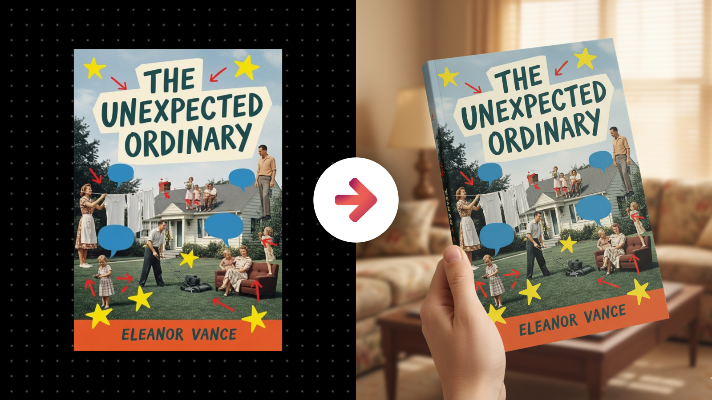

# Realistic Physical Book Mockup POV

**Category:** Book & Publication Mockups

**Quick Description:** Photorealistic book mockup held in realistic hands.

## Images

## Prompt

Use this prompt to transform your uploaded book cover into a photorealistic premium mockup, perfectly preserved and shown as if held in the viewer’s own hands.
Image Prompt:
[Attach an image of you or the main subject of your image]
Then paste this prompt in the chat along with your uploaded image...
Analyze the subject in the attached image and generate an image of them into the scene described in this prompt. First, study the uploaded book cover or document design with meticulous precision, preserving every element—typography, imagery, layout, spacing, proportions, and brand colors—exactly as it appears. The design identity is sacred and must never be distorted, cropped, recolored, or reinterpreted. The book must appear as a premium printed object, with full-bleed design wrapping seamlessly over the cover, spine, and edges, as if professionally produced. Render it with realistic weight, thickness, and surface qualities—smooth matte for elegance, glossy for sleek modernity, or soft-touch textures for a refined tactile impression. Then, generate a point-of-view perspective in which the book is being held naturally by the viewer, but not tightly cropped—allow some breathing room so that both the book and its environment are visible. The hands and arms should appear realistic, supportive, and secondary, never stealing attention, with skin tones and gestures feeling natural and proportional. The book itself must remain tack-sharp, fully legible, and dominant in the composition, always the focus of the scene. The environment beyond should be softly blurred but intentionally brand-aligned, supporting the perceived benefits and value of the resource. For example, a professional business guide might be set against a softly blurred desk scene with executive cues like clean lines, muted luxury props, or subtle tech devices. A creative workbook might sit within a blurred artistic studio vibe, with faint hints of color fields, tools, or inspiring textures. A wellness or lifestyle book might be held in a calm setting, with blurred greenery, soft fabrics, or warm light suggesting balance and serenity. Props and surfaces must never distract but instead echo the promise of the resource—productivity, creativity, success, wellness, or education—making the book feel like the key to those outcomes. Lighting must sculpt the book realistically and atmospherically: soft daylight for approachable, positive resources; bold directional light for authoritative, impactful content; or moody cinematic shadows for depth and gravitas. Depth of field should keep the book sharply defined, with gradual falloff that blurs the background into pleasing tones and textures, creating immersion and focus. Variations must keep results dynamic: sometimes the book is centered upright at arm’s length, sometimes angled slightly downward toward a desk surface, sometimes tilted naturally in a relaxed hand position, sometimes shown partly open to reveal interior spreads. None should feel repetitive—the composition must always feel intentional, premium, and cinematic. Post-processing should finalize realism and cohesion with subtle enhancements: contrast refinement, clarity sharpening, bloom on highlights, soft vignette, or gentle grain if appropriate. The final image must feel immersive, aspirational, and premium—as if the viewer is already holding a high-value, beautifully produced book they’ve just gained access to, making the resource immediately desirable and credible. 

👉 IMAGE ASPECT RATIO (OPTIONAL): 
👉 ADDITIONAL DETAILS (OPTIONAL): 
​

---

Original Notion URL: https://designhacker.notion.site/Realistic-Physical-Book-Mockup-POV-2808ee976d0c80189b26fea40ee3eb25