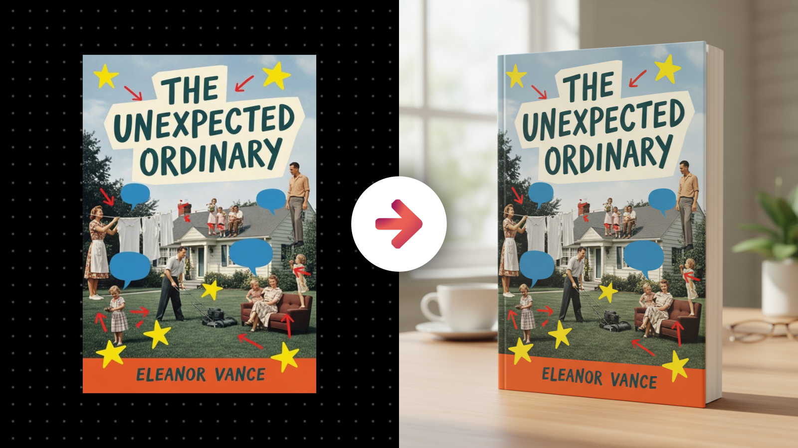

# Realistic Physical Book Mockup

**Category:** Book & Publication Mockups

**Quick Description:** High-quality, realistic book mockup with varied scenes.

## Images

## Prompt

Use this prompt with your uploaded book cover or document design to generate a photorealistic, premium-quality book presentation.
Image Prompt:
[Attach an image of you or the main subject of your image]
Then paste this prompt in the chat along with your uploaded image...
Analyze the subject in the attached image and generate an image of them into the scene described in this prompt. First, study the uploaded book cover or document design with meticulous precision, preserving every single element—typography, proportions, imagery, layout, spacing, and colors—exactly as it is, without distortion, cropping, stretching, or reinterpretation. The design identity must remain flawless and intact at all times. Then, render the design as a premium printed book, never as a flimsy sheet or disposable printout. The book must appear dimensional and substantial, with visible spine thickness, page depth, and realistic binding. Covers must always be full-bleed, with no borders or edges, wrapping naturally across the surface as though this were a professionally produced edition. The material should project quality—whether matte, glossy, soft-touch, or textured—so the book feels high-value and credible. Composition should vary across different mockups to give the resource multiple premium looks: sometimes a single upright book standing with authority, sometimes a slightly angled cover propped on a surface, sometimes an open spread revealing interior content with natural page curvature, sometimes a stacked set of multiple copies to signal abundance and value, and sometimes a cinematic close-up highlighting the spine, cover texture, or page edges. Each variation should feel like it was created during a bespoke brand photoshoot, not like a generic template. The environment surrounding the book must be intentional and supportive, designed to reinforce the promise and benefit of the resource. A professional report might sit on a clean executive surface with subtle blurred props signaling sophistication. A creative workbook might rest on vibrant textured backdrops with artistic elements that echo its energy. A wellness or lifestyle guide might be paired with calm, natural surfaces like wood, linen, or stone, softly lit to create balance and serenity. Backgrounds should remain secondary but must always amplify the perceived value of the book, making it feel desirable and aspirational. Lighting is critical: soft daylight can make the book approachable and fresh, studio lighting can make it polished and authoritative, while cinematic shadow play can add mood and drama for impactful resources. Each generated scene should feel unified through careful attention to light falloff, reflections, and shadow placement, ensuring the book feels like a real object that belongs within its environment. Post-processing must elevate the final output into a premium brand-ready visual: clean contrast, refined clarity, soft vignette for focus, subtle bloom, or a hint of grain to enhance realism. No two outputs should look repetitive; each must tell a slightly different story while always presenting the book as the star. The result must feel like a high-end mockup of a professionally produced book—polished, photorealistic, and aspirational—something that conveys credibility, authority, and high perceived value at first glance, making viewers want to download or own the resource immediately. 

👉 IMAGE ASPECT RATIO (OPTIONAL): 
👉 ADDITIONAL DETAILS (OPTIONAL): 
​

---

Original Notion URL: https://designhacker.notion.site/Realistic-Physical-Book-Mockup-2808ee976d0c80728334fea45cc53b80