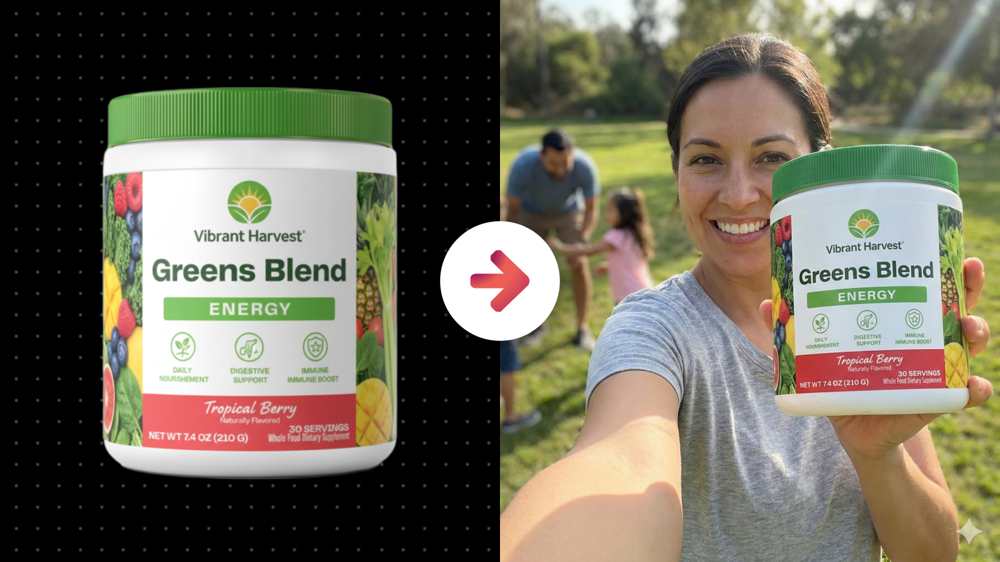

# Realistic Selfie-Style Photo with a Physical Product

**Category:** Physical Product Mockups

**Quick Description:** Realistic selfies with products in natural settings.

## Images

## Prompt

Use this prompt with a product image you upload. 
The tool will extract the product’s identity exactly, then generate candid, phone-captured lifestyle selfies that feel like genuine user-generated content. Raw and spontaneous, but still seamlessly aligned with the brand’s world.
Image Prompt:
[Attach an image of your product]
Then paste this prompt in the chat along with your uploaded image...
Analyze the attached reference image strictly to preserve the product exactly as shown, including its precise shape, proportions, materials, surface texture, label design, colors, typography, and all printed details. The product must remain visually identical and immediately recognizable in the final image. Use the reference image only to reproduce the product itself. Generate a single realistic front-facing smartphone selfie image where the camera viewpoint is the phone camera and the final frame represents exactly what the customer captured on their screen. The subject is holding the product in their own hand while taking the selfie, bringing the product closer to the lens than their face so it appears slightly larger through natural perspective. The environment and scene must be chosen intentionally to match the product’s brand identity and lifestyle context inferred from the product’s design cues, label language, and overall vibe, creating a believable real-world moment where a customer would naturally take this selfie. Do not copy any background from the reference image. Build a fresh scene that fits the product organically and feels like real user-generated content. The lighting on the product must be physically consistent with the rest of the scene, sharing the same light direction, intensity, color temperature, and environmental influence as the subject’s face, arm, and surroundings. Highlights, shadows, and reflections on the product should respond naturally to the scene’s primary light source and ambient bounce, with soft shadow falloff, subtle contact shadows from fingers, gentle edge shading, and realistic spill so the product feels fully embedded in the moment rather than layered on top. Exposure on the product must match the phone camera’s automatic exposure behavior, including realistic highlight rolloff, midtone balance, and slight differences in brightness caused by distance to the lens and hand positioning, while keeping the label clear and readable. The composition must read as true first-person selfie POV, with the subject looking directly into the lens at natural arm’s-length distance, using a wide-angle front camera feel with mild distortion, casual framing, and small handheld imperfections. Subtle selfie cues may appear naturally, such as a forearm entering from the lower edge, slight tilt, minor cropping, and gentle motion softness consistent with a real handheld phone capture. Depth of field should resemble a phone selfie, keeping both the face and product generally sharp while prioritizing the product for clarity. The subject should feel like a real customer, with natural skin texture, casual styling, relaxed expression, and unposed body language consistent with an authentic moment. Color grading should remain minimal and phone-like, with natural tones and restrained contrast, plus subtle realism artifacts such as mild compression softness, sensor noise, or gentle lens flare, ensuring the product and subject feel captured together in one cohesive exposure. Avoid any third-person framing cues, avoid showing the phone device, avoid mirror-like compositions, and avoid any look that suggests the product was pasted into the scene. The final image must read as a genuine selfie taken by the customer, with the product fully integrated through consistent lighting, shadow behavior, perspective, and exposure across the entire frame.

👉 IMAGE ASPECT RATIO (OPTIONAL): 
👉 ADDITIONAL DETAILS (OPTIONAL): 
​

---

Original Notion URL: https://designhacker.notion.site/Realistic-Selfie-Style-Photo-with-a-Physical-Product-2808ee976d0c806fbdcfcbced39431b7