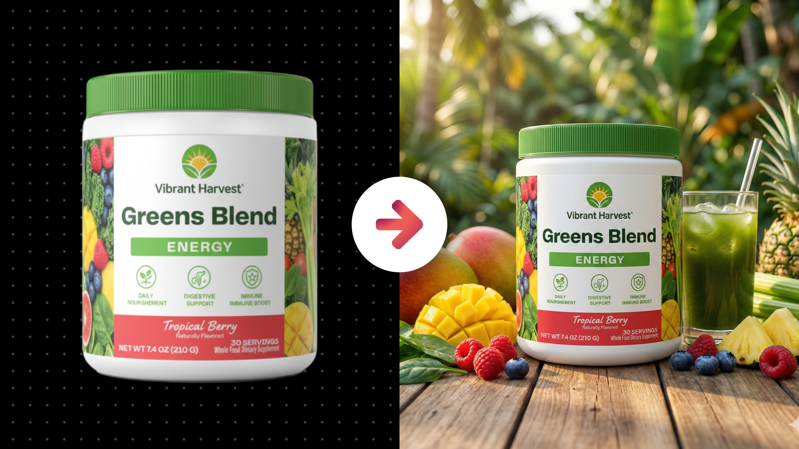
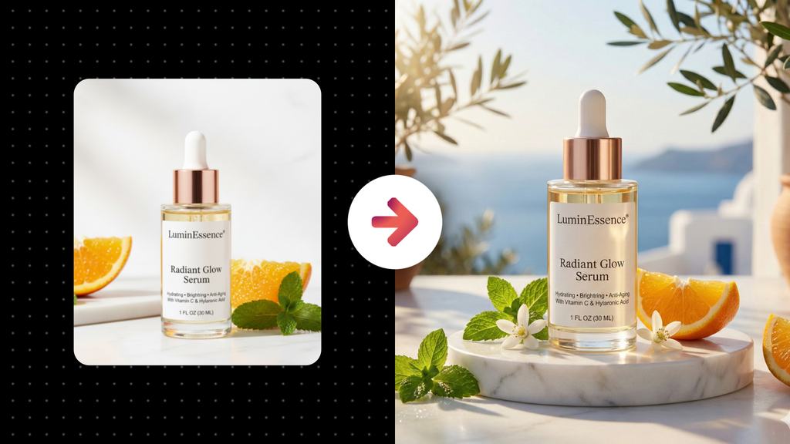
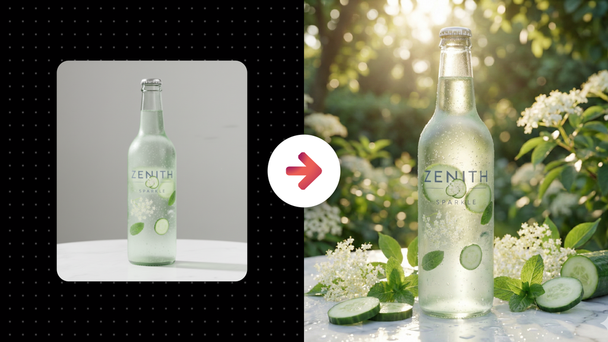

# Realistic Stock Photo of a Physical Product in Natural Setting

**Category:** Physical Product Mockups

**Quick Description:** High-quality ad image with precise product focus.

## Images

## Prompt

Use this prompt with your uploaded product photo. 
The tool will extract the product identity exactly, then design a single, campaign-quality advertising photo where the product is staged in the most appropriate environment for its brand and audience. The artistry must come from real photography techniques… lighting, composition, texture, depth, props, and atmosphere. Creative freedom in angles, zoom, and perspective should be embraced, ensuring the results never feel cookie cutter but instead look like a professional photographer exploring the best possible ways to tell the product’s story.
Image Prompt:
[Attach an image of the product you want to feature]
Then paste this prompt in the chat along with your uploaded image...
Analyze the subject in the attached image and generate a single, high-end advertising photograph where the product is the clear and intentional hero. Begin by studying the product with extreme precision. Its geometry, proportions, materials, surface texture, finishes, label layout, typography, and color relationships must be preserved flawlessly so the product remains perfectly identical and immediately recognizable. Use the reference image solely for product identity. All creative decisions about lighting, framing, environment, and mood must be newly constructed. Approach this task as a professional brand photographer working from a creative brief. First interpret the product’s category, personality, and intended audience using visual and semantic cues from the product itself, including its design language, labeling, tone, and implied lifestyle. Then design a setting that naturally expresses that identity and strengthens the product’s message, choosing a scene that feels intentional, believable, and aligned with how the product exists in the real world for its audience. The environment should feel thoughtfully selected and emotionally supportive of the brand, never arbitrary. Artistic impact must come from photographic craft and visual storytelling rather than digital spectacle. Lighting is the primary storytelling tool and must be designed to shape the product, reveal form and texture, guide attention, and create an atmosphere that matches the brand’s emotional tone. Light direction, softness, contrast, and color temperature should feel deliberate and cohesive. Shadows must anchor the product physically within the scene, reflections should be controlled and purposeful, and highlights should accentuate defining features without overpowering them. Composition must place the product as the dominant focal point while allowing for creative variation. The framing should demonstrate intentional art direction through thoughtful choices in camera distance, perspective, and orientation. Some compositions may emphasize intimacy and tactile detail, while others may emphasize context and scale, with each choice driven by brand expression rather than formula. Camera angle and viewpoint should feel chosen for emotional and visual impact, supporting qualities such as confidence, approachability, refinement, or energy depending on what the product communicates. Any surrounding elements must feel authentic, minimal, and relevant, selected for how they interact with light, texture, and composition while reinforcing the product’s positioning. Color treatment should unify the entire image into a cohesive visual language that supports mood and brand recognition, while keeping the product’s true colors accurate. Post-processing should elevate the image to premium campaign quality through refined contrast, clarity, tonal depth, and subtle retouching that enhances realism and polish without drawing attention to itself. The final output must be a single cohesive advertisement image designed as if produced during a real professional campaign shoot. Variety across multiple generations should emerge from genuine photographic exploration through different lighting moods, perspectives, depth of field choices, and compositional strategies, all guided by brand intent. The overarching principle is that the AI behaves as a thoughtful creative professional making deliberate visual decisions. Each image should feel emotionally resonant, visually striking, and authentic, capable of representing the brand at a campaign level with confidence and credibility.

👉 IMAGE ASPECT RATIO (OPTIONAL): 
👉 ADDITIONAL DETAILS (OPTIONAL): 
​

---

Original Notion URL: https://designhacker.notion.site/Realistic-Stock-Photo-of-a-Physical-Product-in-Natural-Setting-2808ee976d0c80cdad37f0680bf12c89