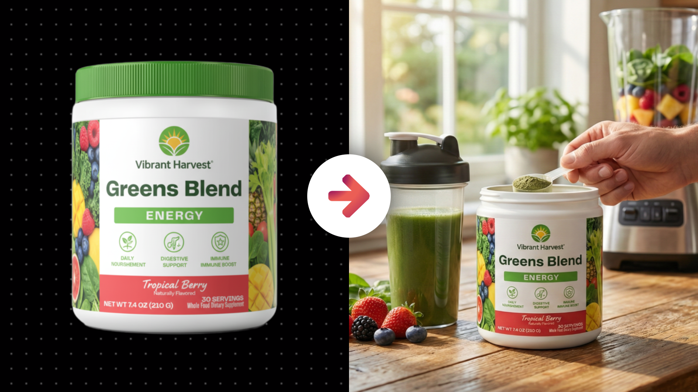
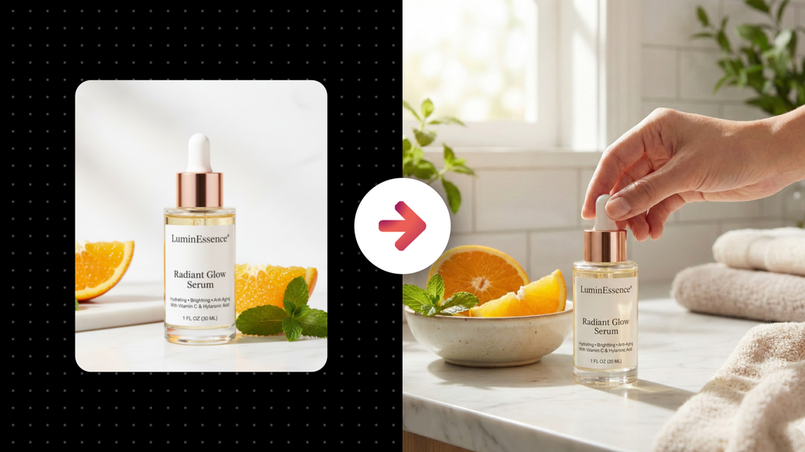
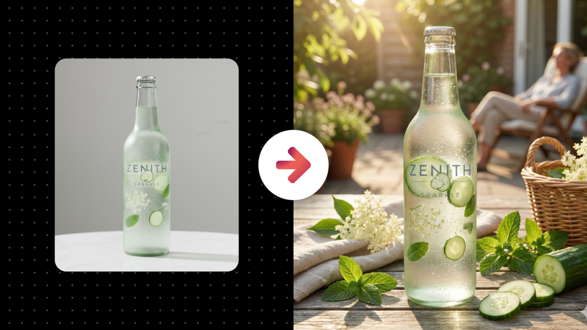

# Realistic Stock Photo of a Physical Product + Target Customer

**Category:** Physical Product Mockups

**Quick Description:** Realistic lifestyle photos featuring your product in context.

## Images

## Prompt

Use this prompt with a product image you upload. 
The tool will analyze the product’s identity with complete precision, then render it seamlessly inside a lifestyle scene that embodies the brand’s DNA, target audience, and intended use-case. The product itself remains perfectly identical, while the surrounding environment, customers, and atmosphere are generated to express the authentic world that the product belongs to.
Image Prompt:
[Attach an image of your product]
Then paste this prompt in the chat along with your uploaded image...
Analyze the subject in the attached image and generate an image of them into the scene described in this prompt. First, analyze the product in the uploaded subject photo with absolute precision, extracting its exact geometry, proportions, textures, finishes, materials, labels, and color details so that it remains identical in every way. This is identity extraction only: do not inherit the source photo’s crop, resolution, lighting, background, or framing. The final output must always adopt the proportions and orientation of a lifestyle campaign photograph, where the product is the clear focal point but integrated into a fully realized world that communicates its brand DNA. The AI must not only stage the product but interpret its category, audience, and use-case to generate an authentic lifestyle scene that feels natural, believable, and aspirational. Think of lifestyle photography as storytelling: the environment, human presence, props, textures, and light must all align with how the product is meant to exist in real life. Customers, if present, must embody the target audience with natural gestures, authentic expressions, and believable interactions that feel observed rather than staged. When people are absent, the environment itself must provide narrative cues: the right surfaces, textures, atmospheric qualities, and contextual objects that communicate lifestyle fit without overwhelming the subject. Composition must position the product as the anchor of the scene, but not in isolation—rather, in harmony with the space around it so that it feels truly lived in. Framing should obey photographic intent, using balance, rhythm, and negative space to guide attention. Depth of field should be treated with intention, allowing the product to sit in believable focus hierarchy against a naturally layered world. Lighting must act as the emotional driver of the scene: analyze direction, intensity, softness, and color temperature to sculpt the product while simultaneously grounding it in its environment. Lifestyle light should always feel motivated—whether natural or artificial—so that shadows, reflections, and highlights behave consistently across both product and background. The tonal contrast must preserve detail while evoking atmosphere: soft gradations for intimacy, crisp highlights for energy, or shadow depth for mood, always matched to the brand identity. Color grading must unify subject and world: protect the product’s hues faithfully while harmonizing the environment to support them, ensuring a cohesive and cinematic palette that communicates mood without distortion. Props and supporting elements should be selected with restraint and intention, always reinforcing lifestyle authenticity rather than cluttering the frame. Materials and textures must be tactile, believable, and contextually appropriate, integrating with light and shadow to provide subtle realism. Post-processing should act as the final unifier, not a disguise: apply cohesive tonal curves, micro-contrast control, gentle retouching, and atmospheric polish so that the finished image reads as a singular campaign-quality photograph. Across variations, keep the product perfectly identical while exploring diversity through scene composition, perspective, depth, environmental nuance, and light quality. Each frame should feel like a unique but connected capture from a branded lifestyle campaign—never repetitive, never generic. Above all, ensure that every generated image is indistinguishable from premium commercial lifestyle photography: authentic, intentional, emotionally resonant, and seamlessly integrated so that the product belongs fully to its environment, expressing the life and world it was designed to inhabit. 

👉 IMAGE ASPECT RATIO (OPTIONAL): 
👉 ADDITIONAL DETAILS (OPTIONAL): 
​

---

Original Notion URL: https://designhacker.notion.site/Realistic-Stock-Photo-of-a-Physical-Product-Target-Customer-2808ee976d0c804182f5d455539d4a8c