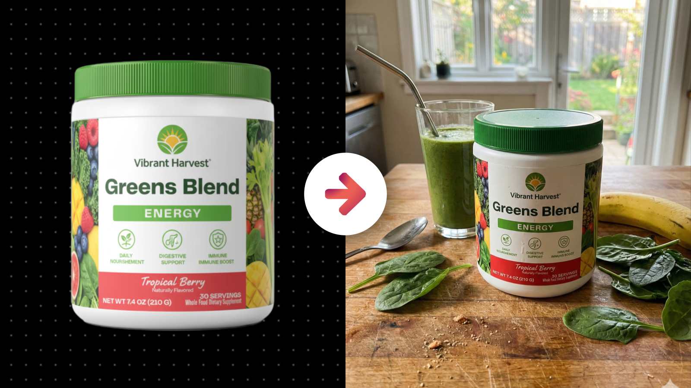
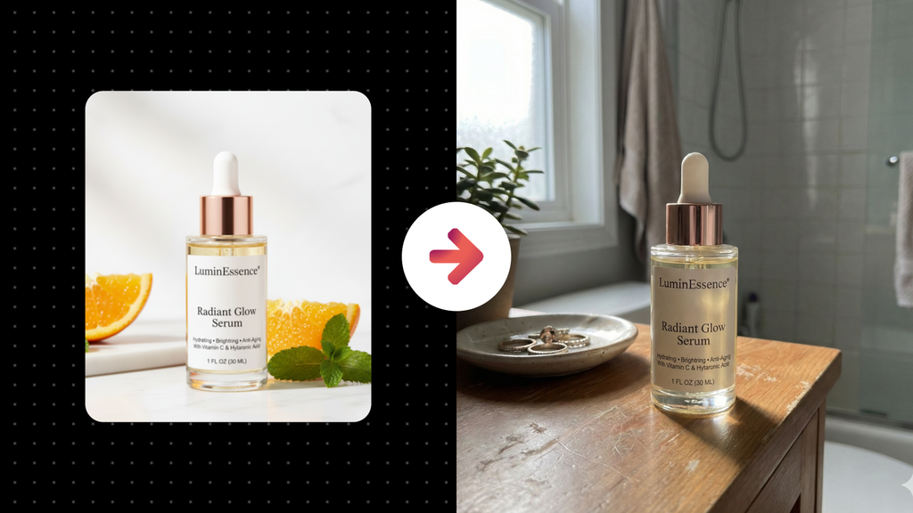
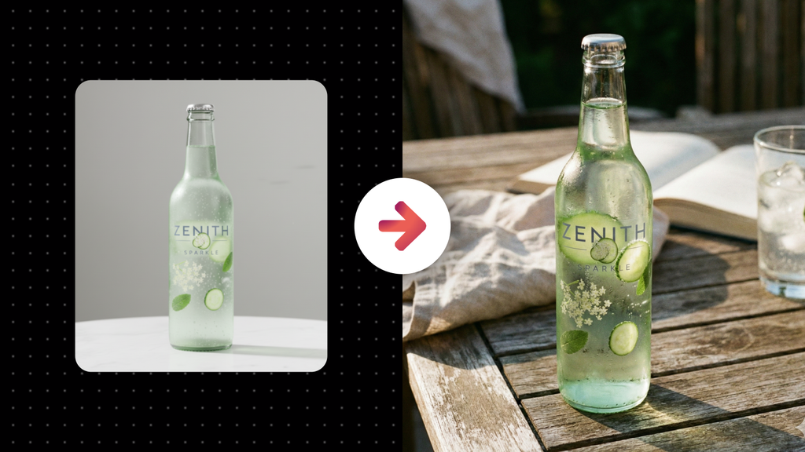

# Realistic User-Generated Lifestyle Photos of a Physical Product

**Category:** Physical Product Mockups

**Quick Description:** Authentic lifestyle photos of products, like real users captured.

## Images

## Prompt

Use this prompt with a product image you upload. 
The tool will extract the product’s identity exactly, then generate branded lifestyle photos that feel like genuine mobile captures. Raw, spontaneous, and candid, as if shot by real users, but refined with subtle polish to match the brand’s world.
Image Prompt:
[Attach an image of your product]
Then paste this prompt in the chat along with your uploaded image...
Analyze the subject in the attached image and generate an image of them into the scene described in this prompt. First, analyze the product in the uploaded subject photo with absolute precision, extracting its exact geometry, proportions, contours, surface behavior, materials, finishes, textures, colors, and any printed or structural details so that it remains perfectly identical and unmistakably the same in the final result. Do not inherit the source image’s crop, resolution, ratio, or lighting. The source is identity reference only. The output must instead be framed and styled as though it were captured on a phone in a real, everyday situation—raw, candid, and unpolished in its immediacy, yet subtly elevated to express the brand’s identity. This is not stock, not staged pro photography, and not glossy campaign production. It must look like something a real person captured themselves, in the moment, without overthinking. Composition should feel intuitive and lived-in rather than perfectly arranged. Framing may have minor quirks—slight tilt, off-center positioning, or handheld perspective—but it must still ensure that the product remains legible, central to the scene, and clearly understood. The AI must prioritize authenticity in how the world is built: natural messiness, tactile surfaces, believable imperfections, and contextual cues that feel human and unmanufactured. Customers, if present, should appear as real people in real situations, embodying the brand audience without exaggeration, posed stiffness, or artificial smiles. Gestures, posture, and expressions must feel like genuine slices of life, captured mid-moment. If no people appear, let the environment still tell a story: subtle traces of human presence, textures that feel lived-in, and objects that exist naturally in the scene rather than staged for it. Lighting must behave like real-world light in candid captures: motivated by believable sources, not studio setups, with shadows, highlights, and reflections behaving naturally. Allow minor exposure quirks that mimic everyday mobile photography, but balance them so the product is still clearly visible. Tonal contrast must preserve realism, avoiding overly cinematic or glossy grading—favor a look that suggests natural capture, with subtle refinement to unify mood and keep the image consistent with brand tone. Color must remain true to the product itself, while the scene harmonizes in a way that feels casual and organic. Props, textures, and background details must exist as part of the world, not as set dressing—every supporting element should look like it belongs in someone’s real space or moment. Post-processing must be restrained: light tonal correction, natural sharpening, balanced exposure, and subtle finishing that makes the shot look “clean enough” without stripping away the raw, human edge. Grain, blur, slight lens quirks, and ambient imperfections are welcome if they reinforce the feeling of authenticity, but they must never obscure product clarity. Above all, this must not feel like pro stock photography—it must feel like a real photo taken on a phone by an actual person, only gently refined to align with brand storytelling. Across variations, the product must stay perfectly identical, but the world around it should shift in believable ways—different moments, angles, depths, lighting conditions, or contextual cues—so the series feels like a collection of real user-generated posts rather than repeated staged shots. The final images must occupy the sweet spot between raw reality and branded storytelling: unmistakably candid in capture, unmistakably consistent in product identity, and emotionally resonant in how they connect to the brand’s audience. 

👉 IMAGE ASPECT RATIO (OPTIONAL): 
👉 ADDITIONAL DETAILS (OPTIONAL): 
​

---

Original Notion URL: https://designhacker.notion.site/Realistic-User-Generated-Lifestyle-Photos-of-a-Physical-Product-2808ee976d0c801e96a9f5622ad921ba