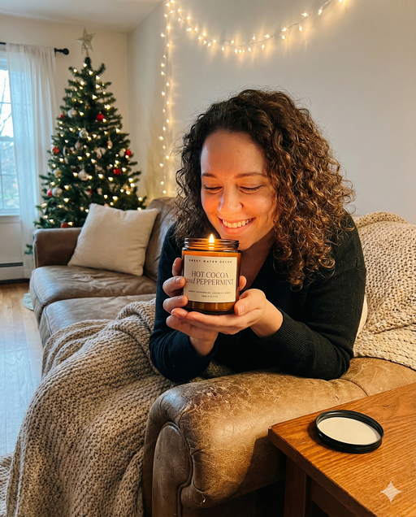
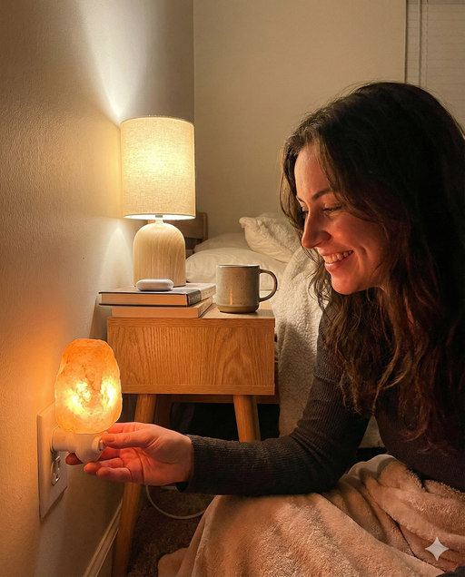
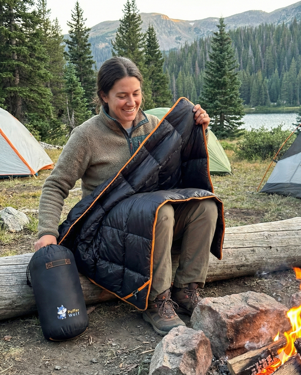
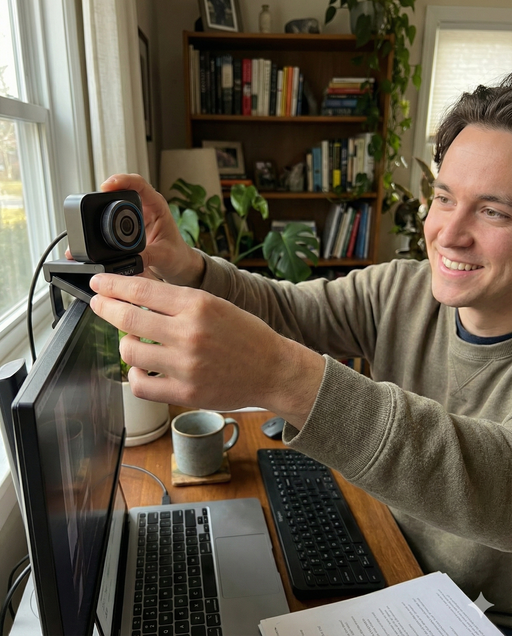

# Realistic User Submitted Photo with a Physical Product

**Category:** Physical Product Mockups

**Quick Description:** Realistic user photo of product in casual setting.

## Images

## Prompt

Image Prompt:
[Attach an image of your product]
Then paste this prompt in the chat along with your uploaded image...
Analyze the attached reference image strictly to preserve the product exactly as shown, including its precise shape, proportions, materials, surface texture, label design, colors, typography, and all printed details. The product must remain visually identical and immediately recognizable in the final image. Use the reference image only to deeply understand and reproduce the product itself, and to infer the most natural, believable way a real customer would hold, use, or present it in a casual real-world moment. Generate a single highly realistic user-generated style photo of the subject interacting with the product, photographed by another person rather than as a selfie, as if a friend casually captured the moment on a smartphone during genuine use or enjoyment. The camera viewpoint should feel handheld, imperfect, and observational, not posed or promotional, with the framing, angle, and distance reflecting how someone would naturally photograph a friend without directing them. The subject should be holding, using, or showing the product in a relaxed, intuitive way that makes sense for the product’s function and lifestyle context, allowing the product to remain clearly visible without feeling staged or deliberately presented to camera. The environment and scene must be intentionally chosen based on cues inferred from the product’s design, label language, materials, and overall vibe, placing the subject in a believable setting where a real customer would naturally be enjoying or using the product. Do not copy any background from the reference image; construct a fresh, organic environment that feels lived-in, spontaneous, and authentic. The lighting on the product must be physically consistent with the rest of the scene, sharing the same light direction, intensity, color temperature, and environmental influence as the subject’s face, body, hands, and surroundings. Highlights, shadows, reflections, and contact points on the product should respond naturally to the scene’s lighting, including subtle finger contact shadows, realistic edge shading, ambient bounce, and gentle specular behavior so the product feels genuinely present in the moment rather than composited. Exposure should mimic real smartphone camera behavior, with slight automatic exposure bias, natural highlight roll-off, balanced midtones, and realistic brightness differences based on the product’s position relative to the light source and camera, while keeping key product details readable. Composition should feel candid and unscripted, with casual framing, slight tilt or off-center placement, minor motion softness, and small imperfections consistent with a real handheld phone photo taken quickly in the moment. Depth of field should resemble a smartphone capture, keeping both the subject and product generally in focus, with the product naturally drawing attention through positioning rather than artificial sharpness. The subject should read as a genuine, happy customer, with natural skin texture, unfiltered expression, relaxed posture, and unposed body language that conveys real enjoyment rather than performance. Color grading should remain minimal and true-to-life, with subtle phone-like processing, restrained contrast, and realistic artifacts such as mild compression softness or sensor noise, ensuring the image feels like authentic UGC. Avoid any studio lighting, influencer-style posing, third-person commercial polish, or signs of intentional product placement. The final image must read as a real, emotionally honest customer-submitted photo of someone genuinely enjoying and interacting with the product, captured naturally by a friend in a fleeting moment of real life, with the product fully integrated through consistent lighting, perspective, exposure, and physical interaction across the entire frame.

ABSOLUTE PRODUCT LOCK RULE: When a product image is provided, you must treat it as a fixed asset. Do not recreate the product from description. Do not redesign it. Do not generate a new version of it. Use the provided product image itself as the product shown in the final graphic. Think of this as placing a real photograph into a scene. You may: Place the product image into a new background. Adjust lighting and shadows to match the environment. Improve realism and sharpness. Adjust perspective slightly if needed to fit the scene. You must not: Change the product’s shape or proportions. Change materials, seams, zippers, straps, or hardware. Change logo size, placement, or design. Simplify or stylize the product. Replace it with a “similar” product. If the final image does not clearly look like the exact same product photo placed into a new environment, the result is incorrect. Always favor literal accuracy over visual style. If exact product fidelity cannot be maintained, do not generate a new product. Keep the product image unchanged and only modify the surrounding scene.

👉 IMAGE ASPECT RATIO (OPTIONAL): 
👉 ADDITIONAL DETAILS (OPTIONAL): 
​

---

Original Notion URL: https://designhacker.notion.site/Realistic-User-Submitted-Photo-with-a-Physical-Product-2e98ee976d0c802cad2df2889dbc070c